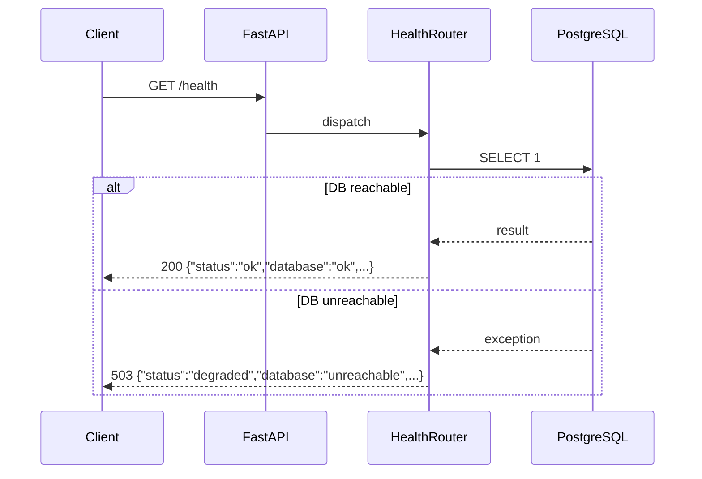

# Design Document

## Health Check API

### Overview

Add a `/health` endpoint to the FastAPI to-do API that returns structured JSON status information about the application and its PostgreSQL database dependency. The endpoint is unauthenticated, registered via a dedicated router, and returns HTTP 200 when healthy or HTTP 503 when the database is unreachable.

The existing stub in `app/main.py` (`@app.get("/health")`) will be removed and replaced by a proper router in `app/api/routes/health.py`, consistent with how all other routes are structured.

---

### Architecture

The health check fits entirely within the existing FastAPI application. No new infrastructure, services, or dependencies are required.



---

### Components and Interfaces

#### `app/api/routes/health.py`

New file. Defines a single `GET /` route on an `APIRouter`. The route:

- Accepts a `Session` via `Depends(get_db)` for the DB probe.
- Executes `db.execute(text("SELECT 1"))` inside a `try/except` to determine DB reachability.
- Reads `settings.APP_NAME` and `settings.APP_ENV` for metadata fields.
- Returns a `HealthResponse` Pydantic schema.
- Raises `HTTPException(503)` when the database probe fails.

#### `app/api/routes/__init__.py`

Updated to import and include the health router at prefix `/health` with tag `"health"`.

#### `app/main.py`

The existing inline `@app.get("/health")` stub is removed to avoid route conflicts.

#### `app/schemas/health.py` (new)

Pydantic response schema:

```python
class HealthResponse(BaseModel):
    status: str          # "ok" | "degraded"
    database: str        # "ok" | "unreachable"
    app_name: str
    environment: str
```

---

### Data Models

No new database tables or ORM models are needed.

**Response payload — healthy:**
```json
{
  "status": "ok",
  "database": "ok",
  "app_name": "Todos API",
  "environment": "development"
}
```

**Response payload — degraded:**
```json
{
  "status": "degraded",
  "database": "unreachable",
  "app_name": "Todos API",
  "environment": "development"
}
```

HTTP status codes: `200` (healthy), `503` (degraded).

---


### Correctness Properties

*A property is a characteristic or behavior that should hold true across all valid executions of a system — essentially, a formal statement about what the system should do. Properties serve as the bridge between human-readable specifications and machine-verifiable correctness guarantees.*

Most acceptance criteria for this feature are fixed-scenario checks (specific HTTP status codes, specific field values for a given DB state) that are best covered by example-based unit tests. Two criteria — the reflection of `APP_NAME` and `APP_ENV` into the response — are genuinely universal: the response must mirror whatever values are configured, regardless of what those values are. These form one combined property.

#### Property 1: Configuration metadata round-trip

*For any* valid `APP_NAME` and `APP_ENV` configuration values, the `/health` response SHALL include an `app_name` field equal to `APP_NAME` and an `environment` field equal to `APP_ENV`.

**Validates: Requirements 3.1, 3.2**

---

### Error Handling

| Scenario | Behaviour |
|---|---|
| DB probe raises any exception | Catch broadly (`except Exception`), set `database = "unreachable"`, return HTTP 503 with `HealthResponse` body |
| DB probe succeeds | `database = "ok"`, return HTTP 200 |
| Missing/invalid config values | Not possible at runtime — `Settings` provides defaults for both `APP_NAME` and `APP_ENV` |

The endpoint must never propagate an unhandled exception to the caller. A 503 with a structured body is always preferable to a 500 with a stack trace, because load balancers and orchestrators parse the status code to make routing decisions.

---

### Testing Strategy

**Dual approach: example-based unit tests + one property-based test.**

#### Unit tests (`tests/test_health.py`)

Use FastAPI's `TestClient` with dependency overrides to mock `get_db`.

| Test | Assertion |
|---|---|
| Healthy response | status 200, `{"status":"ok","database":"ok"}` |
| Degraded response | status 503, `{"status":"degraded","database":"unreachable"}` |
| No auth required | Call without `Authorization` header → not 401/403 |
| Content-Type | Response header contains `application/json` |
| Route exists | GET /health → not 404 |
| `app_name` reflects config | Response `app_name` matches `settings.APP_NAME` |
| `environment` reflects config | Response `environment` matches `settings.APP_ENV` |

#### Property-based test

Library: **[Hypothesis](https://hypothesis.readthedocs.io/)** (standard choice for Python PBT).

```python
# Feature: health-check-api, Property 1: configuration metadata round-trip
@given(
    app_name=st.text(min_size=1, max_size=100),
    app_env=st.text(min_size=1, max_size=50),
)
@settings(max_examples=100)
def test_config_metadata_round_trip(app_name, app_env):
    # Override settings, call endpoint, assert fields match
    ...
```

Each property test runs a minimum of 100 iterations. The test overrides `settings.APP_NAME` and `settings.APP_ENV` with generated strings and asserts the response body echoes them back exactly.

#### What is NOT tested here

- The actual PostgreSQL connection at the network level — that is an integration concern verified by running the full Docker Compose stack.
- Route registration structure (4.2) — verified by code review during implementation.
