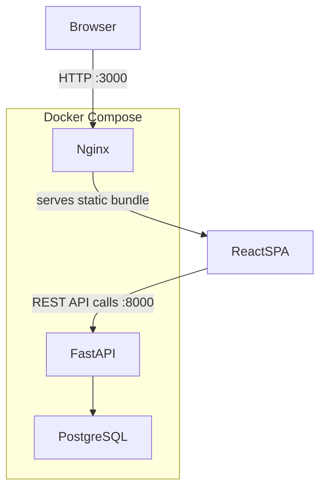
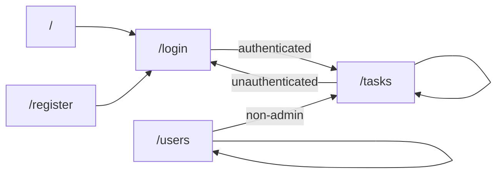
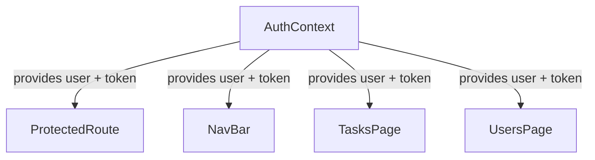

# Design Document: React Frontend App

## Overview

A React single-page application (SPA) that provides a browser-based UI for the existing FastAPI multi-tenant to-do API. The app is served via Nginx inside Docker and communicates with the backend at `http://localhost:8000`.

Key responsibilities:
- JWT-based authentication with session persistence via `localStorage`
- Company-scoped task management (list, create, edit)
- Admin-only user management
- Role-based navigation
- Multi-stage Docker build integrated into the existing `docker-compose.yml`

The frontend is a pure client-side app — no server-side rendering. All data fetching is done via the existing REST API.

---

## Architecture



### Routing Architecture



Public routes: `/login`, `/register`
Protected routes: `/tasks`, `/users`

### State Management

Global auth state is held in a React Context (`AuthContext`). All other state is local to each page component. No external state library (Redux, Zustand) is needed given the limited scope.



---

## Components and Interfaces

### Directory Structure

```
frontend/
├── Dockerfile
├── nginx.conf
├── package.json
├── vite.config.ts
├── index.html
└── src/
    ├── main.tsx
    ├── App.tsx                  # Router setup
    ├── api/
    │   └── client.ts            # Axios instance + interceptors
    ├── context/
    │   └── AuthContext.tsx      # Auth state + actions
    ├── components/
    │   ├── NavBar.tsx
    │   ├── ProtectedRoute.tsx
    │   └── PublicRoute.tsx
    ├── pages/
    │   ├── LoginPage.tsx
    │   ├── RegisterPage.tsx
    │   ├── TasksPage.tsx
    │   └── UsersPage.tsx
    └── types/
        └── index.ts             # TypeScript interfaces
```

### Component Interfaces

**AuthContext**
```ts
interface AuthContextValue {
  user: User | null;
  token: string | null;
  login: (username: string, password: string) => Promise<void>;
  logout: () => void;
  isLoading: boolean;
}
```

**ProtectedRoute / PublicRoute**
- `ProtectedRoute`: renders children if authenticated, otherwise redirects to `/login`
- `PublicRoute`: renders children if unauthenticated, otherwise redirects to `/tasks`

**NavBar**
- Renders only when `user` is non-null
- Shows task list link, username, logout button
- Shows user management link only when `user.is_admin === true`

**TasksPage**
- Fetches and displays tasks for `user.company_id`
- User filter dropdown populated from `GET /companies/{company_id}/users`
- "New Task" button opens `TaskModal` in create mode
- Clicking a task opens `TaskModal` in edit mode

**TaskModal** (shared create/edit)
- Props: `task?: Task` (undefined = create mode), `onClose`, `onSaved`
- Sends `POST` or `PATCH` depending on mode

**UsersPage** (admin only)
- Fetches and displays users for `user.company_id`
- "New User" form inline or modal

---

## Data Models

TypeScript interfaces mirroring the backend Pydantic schemas:

```ts
// types/index.ts

export interface Company {
  id: number;
  name: string;
  description: string | null;
  mode: string | null;
  rating: number | null;
}

export interface User {
  id: number;
  email: string;
  username: string;
  first_name: string | null;
  last_name: string | null;
  is_active: boolean;
  is_admin: boolean;
  company_id: number;
}

export type TaskStatus = 'todo' | 'in_progress' | 'done';
export type TaskPriority = 'low' | 'medium' | 'high';

export interface Task {
  id: number;
  summary: string;
  description: string | null;
  status: TaskStatus;
  priority: TaskPriority;
  company_id: number;
  owner_id: number | null;
}

export interface TaskCreate {
  summary: string;
  description?: string;
  status?: TaskStatus;
  priority?: TaskPriority;
  owner_id?: number;
}

export interface TaskUpdate {
  summary?: string;
  description?: string;
  status?: TaskStatus;
  priority?: TaskPriority;
  owner_id?: number;
}

export interface UserCreate {
  email: string;
  username: string;
  password: string;
  first_name?: string;
  last_name?: string;
}
```

### API Client

A single Axios instance with a request interceptor that attaches the JWT:

```ts
// api/client.ts
const apiClient = axios.create({ baseURL: import.meta.env.VITE_API_URL });

apiClient.interceptors.request.use((config) => {
  const token = localStorage.getItem('token');
  if (token) config.headers.Authorization = `Bearer ${token}`;
  return config;
});

// 401 response interceptor → clear token + redirect to /login
apiClient.interceptors.response.use(
  (res) => res,
  (err) => {
    if (err.response?.status === 401) {
      localStorage.removeItem('token');
      window.location.href = '/login';
    }
    return Promise.reject(err);
  }
);
```

### Docker / Build

Multi-stage Dockerfile:

```dockerfile
# Stage 1: build
FROM node:20-alpine AS build
WORKDIR /app
COPY package*.json ./
RUN npm ci
COPY . .
ARG VITE_API_URL=http://localhost:8000
ENV VITE_API_URL=$VITE_API_URL
RUN npm run build

# Stage 2: serve
FROM nginx:alpine
COPY --from=build /app/dist /usr/share/nginx/html
COPY nginx.conf /etc/nginx/conf.d/default.conf
EXPOSE 80
```

`nginx.conf` must include `try_files $uri /index.html` for client-side routing.

`docker-compose.yml` addition:
```yaml
frontend:
  build:
    context: ./frontend
    args:
      VITE_API_URL: http://localhost:8000
  ports:
    - "3000:80"
  depends_on:
    - api
```

---

## Correctness Properties

*A property is a characteristic or behavior that should hold true across all valid executions of a system — essentially, a formal statement about what the system should do. Properties serve as the bridge between human-readable specifications and machine-verifiable correctness guarantees.*


### Property 1: Form submission sends correct payload

*For any* valid registration or user-creation form data (email, username, password, optional names, company_id), submitting the form should result in a POST request to the correct endpoint containing exactly the submitted field values.

**Validates: Requirements 1.3, 8.4**

### Property 2: Token stored in localStorage on successful login

*For any* `access_token` string returned by a successful `POST /auth/login` response, the Auth_Service should store that exact token value in `localStorage` under the key `token` and navigate to `/tasks`.

**Validates: Requirements 2.3**

### Property 3: User profile loaded into auth state after login

*For any* `User` object returned by `GET /companies/{company_id}/users/me` following a successful login, the auth context should hold that exact user object.

**Validates: Requirements 2.4**

### Property 4: Session restored from stored token on app init

*For any* token string present in `localStorage` when the app initialises, the Auth_Service should enter an authenticated state and fetch `/me` to load the current user.

**Validates: Requirements 3.1**

### Property 5: 401 response clears token and redirects to login

*For any* API request that returns a 401 response (including the `/me` validation call on init), the Auth_Service should remove the token from `localStorage` and redirect the user to `/login`.

**Validates: Requirements 3.2, 4.3**

### Property 6: Logout clears all auth state

*For any* authenticated session (any token value, any user object), clicking the logout button should result in `localStorage` containing no token, the auth context user being null, and the user being navigated to `/login`.

**Validates: Requirements 3.3**

### Property 7: Authorization header present on every authenticated request

*For any* token value stored in `localStorage`, every API request made through the Axios client should include an `Authorization: Bearer <token>` header containing that exact token.

**Validates: Requirements 3.4**

### Property 8: Protected routes redirect unauthenticated users

*For any* protected route path (`/tasks`, `/users`), rendering that route without an authenticated session should redirect the user to `/login`.

**Validates: Requirements 4.1**

### Property 9: Task list displays all returned tasks with required fields

*For any* array of tasks returned by `GET /companies/{company_id}/tasks`, every task in the array should appear in the rendered list showing its summary, status, priority, and owner username.

**Validates: Requirements 5.1, 5.2**

### Property 10: User filter sends correct query parameter

*For any* user ID selected in the task filter control, the Task_Manager should issue a `GET /companies/{company_id}/tasks?user_id={uid}` request with that exact user ID and update the displayed list to the response.

**Validates: Requirements 5.3**

### Property 11: User lists populate all dropdowns correctly

*For any* array of users returned by `GET /companies/{company_id}/users`, every user should appear as a selectable option in both the task filter dropdown and the task assignee dropdown.

**Validates: Requirements 5.4, 6.5**

### Property 12: New task appears in list after creation

*For any* task object returned by a successful `POST /companies/{company_id}/tasks`, the task list should contain that task immediately after creation without a full page reload.

**Validates: Requirements 6.3**

### Property 13: API error messages are displayed in forms

*For any* error message string returned by the API (registration, task create/edit, user create), the relevant form should display that exact error message to the user.

**Validates: Requirements 1.5, 7.4, 8.6**

### Property 14: Edit modal pre-populates with current task data

*For any* task object, opening the edit modal for that task should result in form fields pre-populated with that task's current `summary`, `description`, `status`, `priority`, and `owner_id`.

**Validates: Requirements 7.1**

### Property 15: PATCH request contains only changed fields

*For any* edit form submission where a subset of task fields have been modified, the `PATCH /companies/{company_id}/tasks/{task_id}` request body should contain exactly the changed fields and omit unchanged ones.

**Validates: Requirements 7.2**

### Property 16: Updated task is reflected in the list

*For any* task update response from a successful `PATCH` request, the task entry in the displayed list should reflect the updated field values without a full page reload.

**Validates: Requirements 7.3**

### Property 17: User list displays all users with required fields

*For any* array of users returned by `GET /companies/{company_id}/users`, every user should appear in the UsersPage list showing username, email, first name, last name, and admin status.

**Validates: Requirements 8.2**

### Property 18: New user appears in list after creation

*For any* user object returned by a successful `POST /companies/{company_id}/users` from the admin panel, the user list should contain that user immediately after creation without a full page reload.

**Validates: Requirements 8.5**

### Property 19: NavBar displays correct content for authenticated user

*For any* authenticated `User` object, the NavBar should render a link to the task list, the user's `username`, and a logout button — and additionally a user management link if and only if `user.is_admin === true`.

**Validates: Requirements 9.1, 9.2, 8.1, 8.7**

---

## Error Handling

| Scenario | Handling |
|---|---|
| `GET /companies/` fails on register page load | Show inline error; disable form submission |
| Login 401 | Show "Invalid credentials" on form |
| Login other error | Show generic error on form |
| Any API 401 while authenticated | Axios interceptor clears token + redirects to `/login` |
| Task list fetch fails | Show error message + retry button |
| Create/edit task fails | Show API error message in modal |
| Create user fails (admin) | Show API error message in form |
| Network error (no response) | Show generic "Network error, please try again" |

All API calls use try/catch. Error state is local to the component that triggered the request. The Axios response interceptor handles the global 401 case centrally so individual components don't need to handle session expiry.

---

## Testing Strategy

### Tech Stack

- **Test runner**: Vitest
- **Component testing**: React Testing Library (`@testing-library/react`)
- **Property-based testing**: `fast-check` (minimum 100 iterations per property test)
- **HTTP mocking**: `msw` (Mock Service Worker) for API mocking in tests

### Dual Testing Approach

Unit/example tests cover specific UI states and concrete scenarios. Property-based tests verify universal behaviors across generated inputs.

### Unit / Example Tests

Focus on:
- Specific UI structure (form fields present, NavBar visibility)
- Concrete error states (401 shows "Invalid credentials", empty list shows empty state message)
- Route guard behavior (authenticated user redirected away from `/login`)
- Docker/infrastructure configuration (smoke checks on `docker-compose.yml` and `Dockerfile`)

### Property-Based Tests

Each property from the Correctness Properties section maps to one `fast-check` property test configured to run 100+ iterations.

Tag format for each test:
```
// Feature: react-frontend-app, Property {N}: {property_text}
```

Example:
```ts
// Feature: react-frontend-app, Property 7: Authorization header present on every authenticated request
it('attaches Bearer token to every request', () => {
  fc.assert(
    fc.property(fc.string({ minLength: 1 }), (token) => {
      localStorage.setItem('token', token);
      // intercept request and assert header
    }),
    { numRuns: 100 }
  );
});
```

Properties particularly well-suited to fast-check generation:
- **Property 7** (auth header): generate arbitrary token strings
- **Property 8** (protected routes): generate from the set of protected route paths
- **Property 9** (task list): generate arrays of Task objects
- **Property 13** (error messages): generate arbitrary error message strings
- **Property 14** (edit pre-population): generate arbitrary Task objects
- **Property 15** (PATCH delta): generate Task + partial update, verify only changed keys sent
- **Property 19** (NavBar): generate User objects with varying `is_admin` values

### Coverage Goals

- All 19 correctness properties covered by property tests
- All example/smoke criteria covered by unit tests
- Integration: manual smoke test of full Docker Compose stack (`docker compose up --build`, verify app loads at `http://localhost:3000`)
